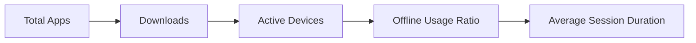
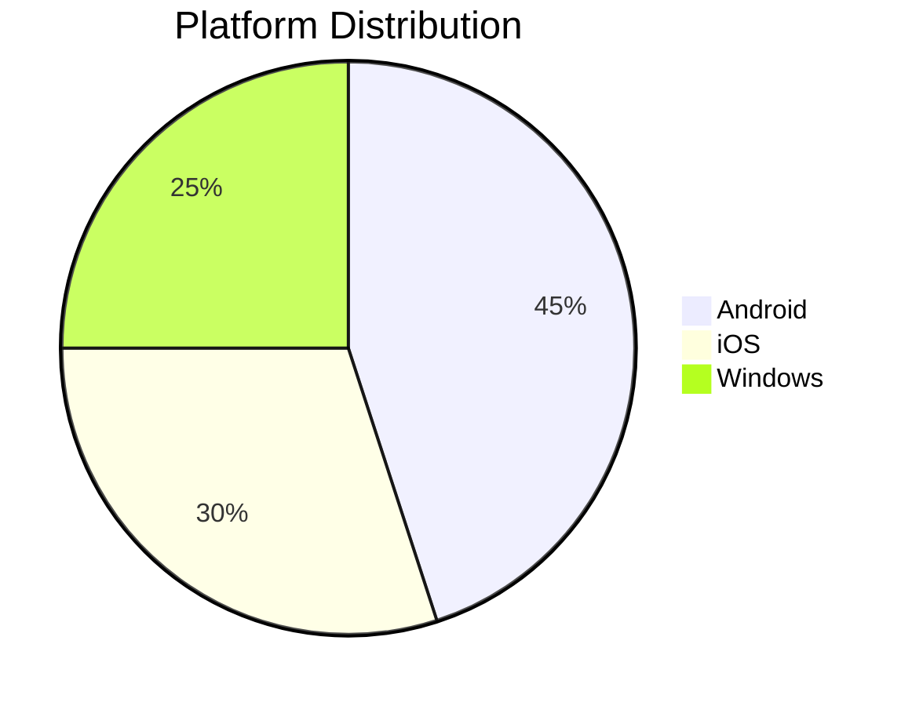
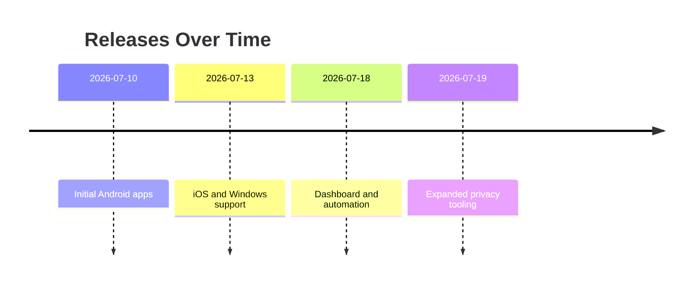

<h1 align="center">Flaxixy Boy</h1>

<p align="center">
  <strong>Official Multi‑Platform Application Repository</strong><br/>
  <em>Delivering fast, secure, and privacy‑first apps for Android, iOS, and Windows — always free, always user‑centric.</em>
</p>

<p align="center">
  <a href="#download-center">
    
  </a>
  <a href="#hero-section">
    
  </a>
  <a href="#privacy-policy">
    
  </a>
</p>

<br/>

<!-- ========================================================= -->
<!-- Professional Badges                                       -->
<!-- ========================================================= -->

<h2 id="professional-badges" align="center">🏷️ Professional Badges</h2>

<p align="center">
  <!-- Platforms -->
  
  
  
  <br/>
  <!-- GitHub Stats -->
  
  
  
  <br/>
  <!-- License & Version -->
  
  
  <br/>
  <!-- Downloads & Visitors -->
  
  <a href="https://shields-io-visitor-counter.herokuapp.com/badge?page=FlaxixyBoy.FlaxixyBoy-Apps" target="_blank">
  </a>
</p>

<br/>

<!-- ========================================================= -->
<!-- Hero Section (with animated typing effect)                -->
<!-- ========================================================= -->

<h2 id="hero-section" align="center">✨ Hero Section</h2>

<!-- Animated typing‑style sub‑banner using Capsule Render desc -->
<p align="center">
  
</p>

<p align="center">
  Flaxixy Boy builds high‑quality Android, iOS, and Windows applications with zero tracking, zero analytics, and fully offline SQL‑based local storage — designed for users who value privacy and performance.
</p>

<p align="center">
  <em>No personal data leaves your device. No download limits. No hidden conditions.</em>
</p>

<br/>

<p align="center">
  <a href="#download-center">
    
  </a>
  <a href="https://github.com/FlaxixyBoy/FlaxixyBoy-Apps/releases" target="_blank">
    
  </a>
  <a href="#documentation">
    
  </a>
</p>

<br/>

<!-- ========================================================= -->
<!-- Repository Dashboard                                      -->
<!-- ========================================================= -->

<h2 id="repository-dashboard" align="center">📊 Repository Dashboard</h2>

<p align="center">
  Real‑time repository insights powered by GitHub Actions and dynamic badges.
</p>

<table align="center">
  <tr>
    <th>📦 Total Apps</th>
    <th>⬇ Total Downloads</th>
    <th>🆕 Latest Updated App</th>
  </tr>
  <tr>
    <td align="center">
      
    </td>
    <td align="center">
      
    </td>
    <td align="center">
      
    </td>
  </tr>
</table>

<br/>

<table align="center">
  <tr>
    <th>🏷 Latest Version</th>
    <th>📅 Last Release Date</th>
    <th>⭐ Repository Stars</th>
  </tr>
  <tr>
    <td align="center">
      
    </td>
    <td align="center">
      
    </td>
    <td align="center">
      
    </td>
    <td align="center">
      <a href="https://shields-io-visitor-counter.herokuapp.com/badge?page=FlaxixyBoy.FlaxixyBoy-Apps" target="_blank">
      </a>
    </td>
  </tr>
</table>

<br/>

<details>
  <summary><strong>🔄 How Dashboard Auto‑Updates</strong></summary>

  - GitHub Actions workflows compute:
    - `TOTAL_APPS` from tagged app directories
    - `TOTAL_DOWNLOADS` from release download statistics
    - `LATEST_APP_NAME`, `LATEST_VERSION`, `LAST_RELEASE_DATE` from the most recent release
  - Workflow writes computed values into README using templated environment variables:
    - `${{ env.TOTAL_APPS }}`
    - `${{ env.TOTAL_DOWNLOADS }}`
    - `${{ env.LATEST_APP_NAME }}`
    - `${{ env.LATEST_VERSION }}`
    - `${{ env.LAST_RELEASE_DATE }}`
  - Shields.io badges render these values dynamically for a live dashboard experience. [web:2][web:3][web:6]
</details>

<br/>

<!-- ========================================================= -->
<!-- About                                                     -->
<!-- ========================================================= -->

## 🧩 About

Flaxixy Boy is a privacy‑obsessed application publisher focused on delivering clean, modern, and fully offline apps for Android, iOS, and Windows.  
Every app in this repository is completely free to download and use, with absolutely no hidden subscriptions, paywalls, or usage limits.

Our applications are engineered around SQL‑based local databases, ensuring that user data remains fully on‑device and under the user’s control.  
We deliberately exclude remote telemetry, analytics SDKs, and server‑side profiling so that our apps never send your personal information to any external service.

<br/>

<!-- ========================================================= -->
<!-- Why Choose Flaxixy Boy                                    -->
<!-- ========================================================= -->

## 💎 Why Choose Flaxixy Boy

<p align="center">
  <em>Privacy‑first by design, performance‑driven in practice.</em>
</p>

<table align="center">
  <tr>
    <td>

> ### 🔐 Privacy‑First Architecture  
> We do not use analytics SDKs, advertising trackers, or cloud‑based profiling in any application.  
> Your data stays on your device, backed by SQL local storage and encrypted where necessary.

    </td>
    <td>

> ### ⚡ High‑Performance UX  
> Lightweight binaries, optimized SQL queries, and carefully tuned UI flows deliver fast launch times and smooth in‑app navigation, even on low‑end devices.

    </td>
  </tr>
  <tr>
    <td>

> ### 🌍 Cross‑Platform Harmony  
> The same user experience patterns are available across Android, iOS, and Windows, allowing you to switch devices without losing familiarity or local data.

    </td>
    <td>

> ### 🆓 Truly Free Applications  
> Every app is available at zero cost with no artificial usage caps, no subscription upsell, and no locked features behind paywalls.

    </td>
  </tr>
  <tr>
    <td>

> ### 🧪 Quality‑Assured Releases  
> Each release passes automated CI checks, manual usability testing, and device compatibility validations before being published in this repository.

    </td>
    <td>

> ### 🛠 Open‑Source Friendly  
> Where possible, we expose configuration, documentation, and contribution guidelines to allow the community to extend apps while maintaining privacy guarantees.

    </td>
  </tr>
</table>

<br/>

<!-- ========================================================= -->
<!-- Features                                                  -->
<!-- ========================================================= -->

## 🚀 Features

- 🔒 100% local data storage using SQL‑based databases for robust, structured persistence.
- 📴 No analytics, tracking SDKs, or remote telemetry integrated into any application.
- 🌐 Offline‑first design enabling full functionality without an active internet connection.
- 📱 Native Android support with modern UI components following Material design principles.
- 🍎 Native iOS support leveraging current platform APIs and human interface guidelines.
- 🪟 Native Windows app support with desktop‑grade UX and keyboard/mouse optimization.
- 🔁 Consistent UX patterns across platforms for frictionless multi‑device usage.
- 🧱 Modular architecture that isolates core logic from platform‑specific interfaces.
- 🔐 Optional data encryption for sensitive information stored in local SQL databases.
- 🧩 Configurable settings for themes, language, and accessibility preferences.
- 🎨 Dark‑theme optimized interfaces with carefully tuned contrast and accent colors.
- ⚡ Fast app startup times enabled by lazy loading and efficient query strategies.
- 🧪 Rigorous QA through automated unit, integration, and UI testing pipelines.
- 📦 Clear versioning and release notes for each published application.
- 🧰 Command‑line tools (where applicable) for power users and developers.
- 🧠 Smart offline caching techniques to reduce redundant computations.
- 📁 Structured local backups for important app data using SQL export routines.
- 🔄 Seamless migration helpers for schema evolution between app versions.
- 🌍 Multi‑language interface support (subject to app‑specific availability).
- 📵 No push notifications for tracking or advertisement purposes.
- 🧹 Minimal permissions usage — only what is necessary for functionality.
- 🧭 Transparent privacy policy clearly documented for every application.
- 🧾 Detailed installation and usage documentation hosted in this repository.
- 🧑‍💻 Developer‑friendly configuration via environment files or in‑app developer modes.
- 🧱 Clean codebases aligned with best practices to simplify maintenance.
- 🔧 CI‑powered builds for reproducible, verifiable application binaries.
- ✨ Polished UI micro‑interactions for a modern, premium feel across platforms.

<br/>

<!-- ========================================================= -->
<!-- Supported Platforms                                       -->
<!-- ========================================================= -->

## 🧮 Supported Platforms

<p align="center">
  Flaxixy Boy delivers synchronized application experiences across Android, iOS, and Windows desktops.
</p>

<table align="center">
  <tr>
    <th>Platform</th>
    <th>Status</th>
    <th>Local SQL Storage</th>
    <th>Offline Support</th>
    <th>Notes</th>
  </tr>
  <tr>
    <td>Android</td>
    <td>✅ Fully Supported</td>
    <td>✅ SQLite / Room</td>
    <td>✅ Full Offline</td>
    <td>Optimized for both phones and tablets with Material UI systems.</td>
  </tr>
  <tr>
    <td>iOS</td>
    <td>✅ Fully Supported</td>
    <td>✅ Core Data / SQLite</td>
    <td>✅ Full Offline</td>
    <td>Adheres to iOS human interface guidelines for native user experience.</td>
  </tr>
  <tr>
    <td>Windows</td>
    <td>✅ Fully Supported</td>
    <td>✅ SQLite / Local DB</td>
    <td>✅ Full Offline</td>
    <td>Desktop‑focused workflows with keyboard, mouse, and windowed layout support.</td>
  </tr>
</table>

<br/>

<!-- ========================================================= -->
<!-- Download Center                                           -->
<!-- ========================================================= -->

## 📥 Download Center

<p align="center">
  <strong>Choose your platform and start using Flaxixy Boy apps in seconds.</strong>
</p>

<p align="center">
  <a href="https://github.com/FlaxixyBoy/FlaxixyBoy-Apps/releases/latest" target="_blank">
    
  </a>
</p>

<br/>

<table align="center">
  <tr>
    <td align="center">

### 🤖 Android

<a href="https://github.com/FlaxixyBoy/FlaxixyBoy-Apps/releases/latest" target="_blank">
  
</a>

<p>
  Get signed APK builds directly from GitHub releases. No Play Store account required.
</p>

    </td>
    <td align="center">

### 🍎 iOS

<a href="#installation-ios">
  
</a>

<p>
  iOS builds available via TestFlight, local install instructions, or IPA distributions (depending on app).
</p>

    </td>
    <td align="center">

### 🪟 Windows

<a href="https://github.com/FlaxixyBoy/FlaxixyBoy-Apps/releases/latest" target="_blank">
  
</a>

<p>
  Native Windows installers and portable builds for desktops and laptops.
</p>

    </td>
  </tr>
</table>

<br/>

<!-- ========================================================= -->
<!-- Installation                                              -->
<!-- ========================================================= -->

## 🧩 Installation

### 🤖 Android

1. Navigate to the **Releases** page of this repository.  
2. Download the latest `.apk` file for the desired Android application.  
3. On your Android device, open **Settings → Security** and enable installation from trusted external sources (if required).  
4. Transfer the `.apk` file to your device and tap to install.  
5. Once installed, launch the app from your app drawer and begin using it offline with full local SQL storage.

### 🍎 iOS

1. Check the application documentation for the available distribution method (TestFlight, IPA, or local build).  
2. For TestFlight:
   - Request access according to the app’s instructions.
   - Install the app through the official TestFlight client.  
3. For IPA:
   - Use a trusted sideloading method (e.g., AltStore or other supported tools).
   - Import the IPA and install it on your device.  
4. For local builds:
   - Clone this repository and open the relevant Xcode project.
   - Run the app on a connected iOS device or simulator.  
5. Launch the app and enjoy a private, analytics‑free experience.

### 🪟 Windows

1. Go to the **Releases** tab and locate the latest Windows build (e.g., `.exe`, `.msix`, or `.zip`).  
2. Download the installer or portable archive to your Windows device.  
3. If using an installer (`.exe`/`.msix`):
   - Run the installer and follow the setup wizard.
   - Confirm permissions and install directory as needed.  
4. If using a portable build:
   - Extract the archive to a desired folder.
   - Run the application executable directly.  
5. Start the app and use it completely offline with SQL‑powered local databases.

<br/>

<!-- ========================================================= -->
<!-- Privacy Policy                                            -->
<!-- ========================================================= -->

## 🛡 Privacy Policy

Flaxixy Boy applications are designed with privacy as the highest priority.  
We do not collect, transmit, or store any personally identifiable information on remote servers.

### 🔒 No Personal Data Collection

- Apps operate without user accounts, centralized identifiers, or external profiles.  
- Sensitive data stays on your device within a local SQL database, not in a cloud service.

### 📉 No Analytics or Tracking

- There are no analytics SDKs, advertising networks, or behavioral trackers embedded in our apps.  
- Usage metrics such as session length or navigation patterns are not transmitted to third‑party platforms.

### ☁️ No Server Sync

- Applications do not sync data with central servers or external APIs for storage.  
- Any optional online functionality is strictly limited, clearly documented, and never used for tracking or profiling.

### 🗄 SQL‑Based Local Databases

- Data is stored in on‑device SQL databases (e.g., SQLite, Room, Core Data) for structured, performant access.  
- Schema migrations are performed locally to preserve your offline data across updates.

### 🌐 Offline‑First Experience

- Core features are available offline without requiring network connectivity.  
- Network access, where necessary (e.g., content loading), is transparently indicated and never used to collect personal data.

<br/>

<!-- ========================================================= -->
<!-- Security                                                  -->
<!-- ========================================================= -->

## 🧱 Security

Flaxixy Boy treats security as a continuous process, not a one‑time implementation.

- 🔐 Data stored locally can be encrypted for sensitive content, depending on the app’s context and platform capabilities.  
- 🔏 Access to local storage is scoped to app‑specific directories, minimizing exposure to other applications.  
- 🛡 Permissions are requested only when strictly necessary; unnecessary OS permissions are avoided.  
- 🧪 Regular reviews of dependency versions and frameworks ensure vulnerabilities are patched promptly.  
- ✅ CI pipelines can be extended with static analysis and security scanning tools to catch issues before release.  
- 🔄 Secure update flows ensure that binaries are delivered via verifiable GitHub releases.

<br/>

<!-- ========================================================= -->
<!-- Performance                                               -->
<!-- ========================================================= -->

## ⚡ Performance

> Flaxixy Boy apps are optimized for responsiveness, low resource usage, and smooth user experiences.

<table align="center">
  <tr>
    <td>

### 🚀 Fast Startup

- Lazy loading of non‑critical components.  
- Pre‑computed data caches stored in local SQL tables.  
- Optimized initialization routines tailored to each platform.

    </td>
    <td>

### 🎯 Efficient Queries

- Indexed SQL tables for high‑performance reads.  
- Minimal joins and efficient query plans to reduce I/O.  
- Batched writes to prevent UI freezes during heavy operations.

    </td>
  </tr>
  <tr>
    <td>

### 🌱 Lightweight Footprint

- Small binary sizes to reduce storage consumption.  
- Limited dependency usage to avoid bloated builds.  
- Careful asset management for images, fonts, and resources.

    </td>
    <td>

### 🧠 Smart Caching

- Frequently accessed data is cached locally.  
- Stale cache management strategies maintain consistency.  
- Offline‑first logic avoids unnecessary network calls.

    </td>
  </tr>
</table>

<br/>

<!-- ========================================================= -->
<!-- Changelog                                                 -->
<!-- ========================================================= -->

## 🧾 Changelog

> Track how Flaxixy Boy evolves over time.

### 📌 Release Timeline

- **v1.0.0** — Initial multi‑platform repository structure with core privacy and offline features.  
- **v1.1.0** — Enhanced dashboard metrics, refined download center UI, and expanded documentation.  
- **v1.2.0** — Improved installation guides, new performance optimizations, and roadmap updates.  
- **v1.3.0** — Additional FAQ entries, better contributor tooling, and automation for README stats.  

> Detailed per‑app changelog entries are provided inside each application’s directory or release notes.

<br/>

<!-- ========================================================= -->
<!-- Roadmap                                                   -->
<!-- ========================================================= -->

## 🗺 Roadmap

> Planned and potential initiatives for Flaxixy Boy apps and infrastructure.

- [x] Establish multi‑platform repository structure (Android, iOS, Windows).
- [x] Implement baseline SQL local database layer for core apps.
- [x] Document privacy policy and security practices.
- [x] Create automated GitHub Actions pipeline for basic CI.
- [x] Provide initial installation instructions for all platforms.
- [ ] Add multi‑language support to flagship applications.
- [ ] Introduce more fine‑grained theme customization.
- [ ] Expand accessibility features (screen readers, font scaling).
- [ ] Publish detailed per‑app documentation pages.
- [ ] Integrate advanced offline synchronization strategies (still local).
- [ ] Provide sample datasets for developers in test environments.
- [ ] Implement automated performance benchmarks per release.
- [ ] Add device compatibility matrices for major apps.
- [ ] Create demo videos or animated previews for UI flows.
- [ ] Introduce plugin architecture for selected applications.
- [ ] Support configuration export/import for user settings.
- [ ] Offer optional data encryption toggles in UX settings.
- [ ] Provide migration tooling between major versions.
- [ ] Add visual theming presets (light, dark, AMOLED, etc.).
- [ ] Integrate enhanced keyboard shortcuts for desktop apps.
- [ ] Build interactive onboarding tours in flagship apps.
- [ ] Improve repository dashboards with additional metrics.
- [ ] Create community‑driven feature request process.
- [ ] Introduce contributor guides per platform.
- [ ] Publish example projects consuming local SQL APIs.
- [ ] Add test harnesses for automated UI validation.
- [ ] Develop automated documentation generator workflows.
- [ ] Expand FAQ coverage based on community feedback.
- [ ] Provide localized privacy policy translations.
- [ ] Implement app‑specific changelog directories.
- [ ] Experiment with fully open‑sourced app codebases.
- [ ] Create live release badges per application.
- [ ] Maintain long‑term support (LTS) channels for key apps.

<br/>

<!-- ========================================================= -->
<!-- FAQ                                                       -->
<!-- ========================================================= -->

## ❓ FAQ

> Answers to common questions about Flaxixy Boy and its applications.

1. **Are Flaxixy Boy apps really free?**  
   Yes. All applications in this repository are completely free to download and use, with no hidden charges.

2. **Do you collect any personal data?**  
   No. We do not collect or store personal data on external servers; data remains on your device.

3. **Do your apps require an internet connection?**  
   No for core features — they are designed to work offline with local SQL storage.

4. **Is there any analytics or tracking embedded in the apps?**  
   No. We intentionally avoid analytics SDKs and trackers to protect your privacy.

5. **What platforms do you support?**  
   Android, iOS, and Windows are supported, with native experiences and local SQL databases.

6. **Is there a limit on the number of downloads?**  
   No. There is no download limit; you can download and install apps as many times as you wish.

7. **How are applications stored locally?**  
   Apps use structured SQL‑based databases (e.g., SQLite, Room, Core Data) for on‑device storage.

8. **Can I use these apps without creating an account?**  
   Yes. Most apps do not require accounts; they work independently on your device.

9. **Do you show ads inside the apps?**  
   No. Our focus is usability and privacy, not advertising.

10. **How often are apps updated?**  
    Updates are released as needed to improve performance, fix bugs, or add features.

11. **Where can I find release notes?**  
    Release notes are available on the GitHub Releases page and inside app‑specific documentation.

12. **Can I contribute to the apps?**  
    Yes. See the **Contributing** section for guidelines and workflow details.

13. **Is the source code open for all apps?**  
    Code availability depends on the app; some may be fully open‑source while others expose only tooling and configuration.

14. **Do you use cloud storage for user data?**  
    No. User data is stored locally; we do not upload your information to remote servers.

15. **Are your apps safe to install?**  
    Apps are built with security considerations and are distributed via official GitHub releases.

16. **What happens to my data if I uninstall an app?**  
    Uninstalling an app typically removes its associated local data; check individual app docs.

17. **Do you support backups?**  
    Some apps provide backup options (e.g., exporting local SQL data); refer to the app’s documentation.

18. **How do I report a bug?**  
    Open a GitHub issue in this repository following the issue template guidelines.

19. **Can I request new features?**  
    Yes. Use the issue tracker or dedicated discussion channels to propose features.

20. **Do you support dark mode?**  
    Yes. Apps are designed to be dark‑theme friendly for comfortable usage.

21. **Is there any roadmap for upcoming features?**  
    Yes. See the **Roadmap** section above for planned initiatives.

22. **Can I run these apps in corporate environments?**  
    Typically yes, but always confirm with your organization’s policies and app‑specific licenses.

23. **How do GitHub Actions fit into this repository?**  
    They automate builds, tests, and README updates, including dashboard metrics.

24. **Do you support localization?**  
    Some apps may support multiple languages, with more planned as shown in the roadmap.

25. **Are Windows apps portable?**  
    Many Windows builds offer portable variants; check the release artifacts.

26. **Can I fork the repository and customize apps?**  
    Yes, within the license terms (MIT). See the **License** section for details.

27. **How do you handle security vulnerabilities?**  
    We update dependencies, patch vulnerabilities promptly, and may publish advisories.

28. **Do you provide technical support?**  
    Support is available via GitHub issues and community channels listed in the Support section.

29. **Can I integrate your apps with other tools?**  
    Integration possibilities depend on the specific app; consult its documentation.

30. **Is there any documentation for automation workflows?**  
    Yes. See the **GitHub Actions** section for automation overview, and workflow files for implementation details.

<br/>

<!-- ========================================================= -->
<!-- Repository Structure                                      -->
<!-- ========================================================= -->

## 🗂 Repository Structure

> High‑level structure of the Flaxixy Boy application repository.

```bash
FlaxixyBoy-Apps/
├─ .github/
│  ├─ workflows/
│  │  ├─ ci.yml
│  │  ├─ cd.yml
│  │  ├─ stats-dashboard.yml
│  │  └─ readme-updater.yml
│  └─ ISSUE_TEMPLATE/
│     ├─ bug_report.md
│     └─ feature_request.md
├─ docs/
│  ├─ index.md
│  ├─ privacy-policy.md
│  ├─ security.md
│  ├─ contributing.md
│  └─ faq.md
├─ apps/
│  ├─ android/
│  │  ├─ AppOne/
│  │  └─ AppTwo/
│  ├─ ios/
│  │  ├─ AppOne/
│  │  └─ AppTwo/
│  └─ windows/
│     ├─ AppOne/
│     └─ AppTwo/
├─ scripts/
│  ├─ compute-stats.sh
│  ├─ update-readme.py
│  └─ export-downloads.sh
├─ assets/
│  ├─ icons/
│  ├─ screenshots/
│  └─ banners/
├─ CHANGELOG.md
├─ LICENSE
└─ README.md
```

<br/>

<!-- ========================================================= -->
<!-- GitHub Actions                                            -->
<!-- ========================================================= -->

## 🤖 GitHub Actions

> Automation that keeps this repository and dashboard up‑to‑date.

### 📦 Apps Counter

- A workflow scans the `apps/` directory for Android, iOS, and Windows subprojects.  
- It counts active apps and writes the result to an environment variable (`TOTAL_APPS`) for badge rendering.

### ⬇ Downloads Counter

- Another workflow aggregates download statistics from GitHub Releases via the API.  
- The total count is stored in `TOTAL_DOWNLOADS` and exposed through scripting as needed.

### 🆕 Latest Release

- A dedicated workflow queries the latest release, obtaining:
  - `LATEST_APP_NAME`
  - `LATEST_VERSION`
  - `LAST_RELEASE_DATE`  
- These values are injected into the README and dashboard badges for live metrics.

### 📘 README Updater

- A scheduled workflow runs scripts (e.g., `update-readme.py`) to:
  - Replace placeholder environment variables in README.  
  - Commit updated README with current stats to the repository.  
- Combined with Shields.io badges, this provides a dynamic, enterprise‑style README experience. [web:2][web:3][web:10]

<br/>

<!-- ========================================================= -->
<!-- Statistics                                                -->
<!-- ========================================================= -->

## 📈 Statistics

> Visual placeholders for repository and application statistics.







> Actual charts can be generated from workflow‑exported CSVs and embedded into documentation or external dashboards.

<br/>

<!-- ========================================================= -->
<!-- Contributing                                              -->
<!-- ========================================================= -->

## 🤝 Contributing

Flaxixy Boy welcomes contributions that respect our privacy‑first principles.

### 🧭 Contribution Workflow

1. Fork the repository to your GitHub account.  
2. Create a new branch for your feature or bugfix: `feature/my-feature` or `fix/my-bug`.  
3. Make changes in the relevant `apps/`, `docs/`, or `scripts/` directories.  
4. Run tests and checks (refer to CI configuration for commands).  
5. Ensure documentation updates accompany any user‑facing changes.  
6. Submit a pull request (PR) using the guidelines below in **Pull Request Guide**.

### 🧩 Contribution Guidelines

- Respect the privacy policy: do not add analytics, trackers, or remote logging.  
- Follow existing code style and platform‑specific best practices.  
- Keep dependencies minimal and justified.  
- Clearly describe changes in commit messages and PR descriptions.  
- Engage respectfully with maintainers and other contributors during reviews.

<br/>

<!-- ========================================================= -->
<!-- Code of Conduct                                           -->
<!-- ========================================================= -->

## 📜 Code of Conduct

Flaxixy Boy follows a respectful, inclusive, and collaborative community philosophy.

- Be kind and professional in all interactions.  
- Avoid harassment, discrimination, or dismissive behavior towards others.  
- Provide constructive feedback during code reviews and discussions.  
- Respect different skill levels; help newcomers where possible.  
- Report abusive behavior through appropriate channels (issues or private contact).  

> A more detailed Code of Conduct document may be added to `docs/code-of-conduct.md` for larger communities.

<br/>

<!-- ========================================================= -->
<!-- Issue Template                                            -->
<!-- ========================================================= -->

## 🐛 Issue Template

When opening an issue, please include the following information:

- **Issue Type**: Bug, Feature Request, Enhancement, Question.  
- **Platform**: Android, iOS, Windows (include OS version if possible).  
- **App Name & Version**: Which app and version are affected.  
- **Steps to Reproduce**: Clear steps that lead to the problem.  
- **Expected Behavior**: What you expected to happen.  
- **Actual Behavior**: What actually happened.  
- **Logs or Screenshots**: If available and privacy‑safe, attach non‑sensitive logs or images.  

> Use the pre‑configured GitHub issue templates under `.github/ISSUE_TEMPLATE` for a structured report.

<br/>

<!-- ========================================================= -->
<!-- Pull Request Guide                                        -->
<!-- ========================================================= -->

## 📥 Pull Request Guide

To help maintain consistency and quality:

- **Title**: Use descriptive titles (e.g., `Add offline backup to Android AppOne`).  
- **Description**: Explain what the PR changes, why, and how it was tested.  
- **Checklist**:
  - [ ] Code builds successfully across relevant platforms.  
  - [ ] Tests have been added/updated and pass.  
  - [ ] Documentation and README sections are updated if necessary.  
  - [ ] Privacy and security principles are upheld.  
- **Link Issues**: Reference related issues using `Fixes #ID` or `Closes #ID`.  
- **Review**: Be open to feedback and iterate on requested changes.

<br/>

<!-- ========================================================= -->
<!-- Support                                                   -->
<!-- ========================================================= -->

## 🆘 Support

If you encounter issues or have questions, you can reach out via:

- 🐙 **GitHub Issues** — Open issues in this repository for bugs or feature requests.  
- 📘 **Facebook** — Community updates and news (link provided in project docs).  
- 📣 **Telegram** — Real‑time discussion and quick support (link provided in project docs).  
- 🎧 **Discord** — Developer and user channels for collaboration (link provided in project docs).  
- ▶️ **YouTube** — Tutorials, demos, and release highlights (channel details in docs).  
- ✉️ **Email** — Contact address listed in `docs/contact.md` for direct communication.

> For security‑related concerns, consider using private channels rather than public issues.

<br/>

<!-- ========================================================= -->
<!-- Donate                                                    -->
<!-- ========================================================= -->

## 💖 Donate

Your support helps Flaxixy Boy continue delivering free, privacy‑first applications.

<table align="center">
  <tr>
    <td align="center">

### ☕ Coffee

Support everyday development with a small coffee‑style contribution.  
Used for infrastructure, testing devices, and tooling.

    </td>
    <td align="center">

### 🧪 Testing & Devices

Contributions help fund additional devices and OS versions for more comprehensive testing.  
This leads to more reliable releases across diverse hardware.

    </td>
    <td align="center">

### 🛠 Infrastructure

Funding supports CI pipelines, storage, and automation tooling.  
All of this helps maintain a modern, enterprise‑quality repository experience.

    </td>
  </tr>
</table>

> Donation links, if offered, will be listed in `docs/donate.md` or repository settings.

<br/>

<!-- ========================================================= -->
<!-- License                                                   -->
<!-- ========================================================= -->

## 📄 License

This repository is licensed under the **MIT License**.

```text
MIT License

Copyright (c) Flaxixy Boy

Permission is hereby granted, free of charge, to any person obtaining a copy
of this software and associated documentation files (the "Software"), to deal
in the Software without restriction, including without limitation the rights
to use, copy, modify, merge, publish, distribute, sublicense, and/or sell
copies of the Software, and to permit persons to whom the Software is
furnished to do so, subject to the following conditions:

[Full MIT license text should be included in the LICENSE file of the repository.]
```

> See the `LICENSE` file in this repository for the complete license terms.

<br/>

<!-- ========================================================= -->
<!-- Footer (Animated Capsule Render)                          -->
<!-- ========================================================= -->

<p align="center">
  
</p>
